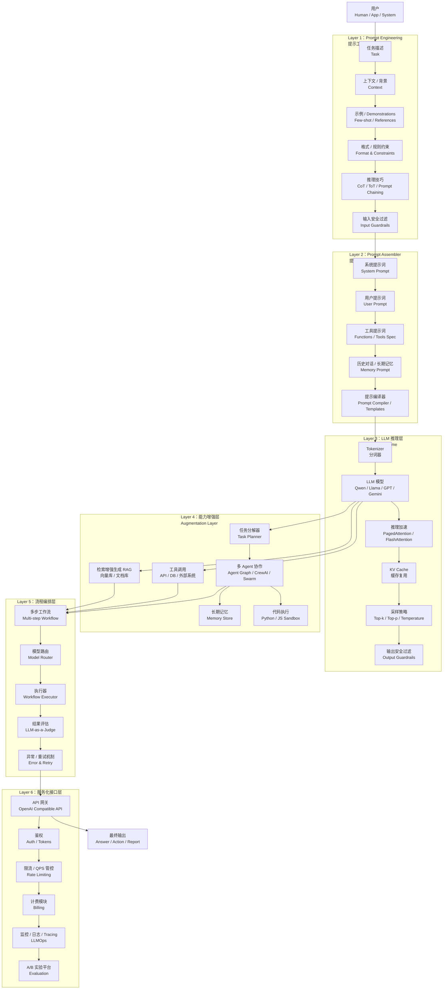

```mermaid

flowchart TB

%% ========== LAYER 0：User Layer ==========
    User[用户\nHuman / App / System]

%% ========== LAYER 1：Prompt Engineering ==========
    subgraph L1[Layer 1：Prompt Engineering\n提示工程层]
        Task[任务描述\nTask]
        Context[上下文 / 背景\nContext]
        Examples[示例 / Demonstrations\nFew-shot / References]
        Constraints[格式 / 规则约束\nFormat & Constraints]
        CoT[推理技巧\nCoT / ToT / Prompt Chaining]
        SafetyCheck[输入安全过滤\nInput Guardrails]
    end
    User --> Task --> Context --> Examples --> Constraints --> CoT --> SafetyCheck

%% ========== LAYER 2：Prompt Assembler ==========
    subgraph L2[Layer 2：Prompt Assembler\n提示编译与组装]
        SystemPrompt[系统提示词\nSystem Prompt]
        UserPrompt[用户提示词\nUser Prompt]
        ToolPrompt[工具提示词\nFunctions / Tools Spec]
        MemoryPrompt[历史对话 / 长期记忆\nMemory Prompt]
        PromptCompiler[提示编译器\nPrompt Compiler / Templates]
    end
    SafetyCheck --> SystemPrompt --> UserPrompt --> ToolPrompt --> MemoryPrompt --> PromptCompiler

%% ========== LAYER 3：LLM Inference & Runtime ==========
    subgraph L3[Layer 3：LLM 推理层\nInference Runtime]
        Model[LLM 模型\nQwen / Llama / GPT / Gemini]
        Tokenizer[Tokenizer\n分词器]
        PagedAttention[推理加速\nPagedAttention / FlashAttention]
        KVCache[KV Cache\n缓存复用]
        Sampler[采样策略\nTop-k / Top-p / Temperature]
        Guardrails[输出安全过滤\nOutput Guardrails]
    end
    PromptCompiler --> Tokenizer --> Model --> PagedAttention --> KVCache --> Sampler --> Guardrails

%% ========== LAYER 4：Augmentation & Agents ==========
    subgraph L4[Layer 4：能力增强层\nAugmentation Layer]
        RAG[检索增强生成 RAG\n向量库 / 文档库]
        Tools[工具调用\nAPI / DB / 外部系统]
        Planner[任务分解器\nTask Planner]
        Agents[多 Agent 协作\nAgent Graph / CrewAI / Swarm]
        Memory[长期记忆\nMemory Store]
        CodeExec[代码执行\nPython / JS Sandbox]
    end
    Model --> RAG
    Model --> Tools
    Model --> Planner
    Planner --> Agents
    Agents --> Memory
    Agents --> CodeExec

%% ========== LAYER 5：Orchestration / Workflow ==========
    subgraph L5[Layer 5：流程编排层\nWorkflow & Orchestration]
        Router[模型路由\nModel Router]
        Workflow[多步工作流\nMulti-step Workflow]
        Executor[执行器\nWorkflow Executor]
        Evaluator[结果评估\nLLM-as-a-Judge]
        RetryHandler[异常 / 重试机制\nError & Retry]
    end

    RAG --> Workflow
    Tools --> Workflow
    Agents --> Workflow
    Workflow --> Router --> Executor --> Evaluator --> RetryHandler

%% ========== LAYER 6：Serving API Layer ==========
    subgraph L6[Layer 6：服务化接口层\nServing & API]
        OpenAIAPI[API 网关\nOpenAI Compatible API]
        Auth[鉴权\nAuth / Tokens]
        RateLimit[限流 / QPS 管控\nRate Limiting]
        Billing[计费模块\nBilling]
        Observability[监控 / 日志 / Tracing\nLLMOps]
        ABTest[A/B 实验平台\nEvaluation]
    end
    RetryHandler --> OpenAIAPI --> Auth --> RateLimit --> Billing --> Observability --> ABTest

%% ========== LAYER 7：Output Layer ==========
    Output[最终输出\nAnswer / Action / Report]
    OpenAIAPI --> Output
```
